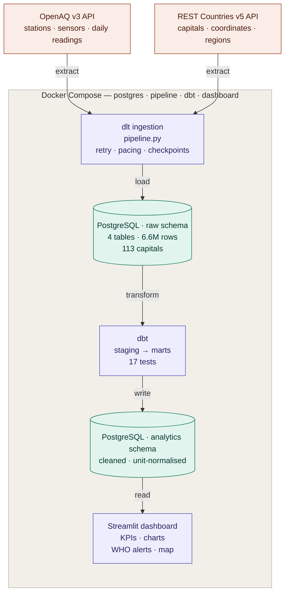

# ITC 6050 — Group 1: Global Air Quality Monitor

End-to-end data pipeline ingesting air quality measurements from the OpenAQ API, transforming them with dbt, and visualising results in Streamlit.

Course project for ITC 6050 Data Engineering, Spring 2026, Deree — The American College of Greece. Instructor: Dr. Maira Kotsovoulou. Submission: 21 July 2026.

## Team

- Ioannis Tsantilas — Ingestion & Infrastructure
- Milena Mirumyan — Transformation & Data Quality
- Nikolaos Voudouris Bountouris — Dashboard & Presentation

## Architecture



The pipeline follows an ELT pattern: data is extracted from both APIs, loaded into the `raw` schema essentially untouched, and only transformed afterwards by dbt into the `analytics` schema. Keeping the raw layer faithful to the source means a transformation can be corrected and re-run without re-downloading anything from the APIs.

## Stack

- **Ingestion:** dlt (OpenAQ v3 + REST Countries v5)
- **Storage:** PostgreSQL 16
- **Transformation:** dbt (dbt-postgres)
- **Dashboard:** Streamlit
- **Orchestration:** Docker Compose

Everything runs in Docker containers, so you do not need to install Python, Postgres, dbt, or Streamlit on your machine. You only need Docker Desktop.

## Prerequisites

- **Docker Desktop** — https://www.docker.com/products/docker-desktop
  - macOS: install and launch. That's it.
  - Windows: install with the WSL2 backend enabled. Follow the Docker install wizard prompts.
- **Git** — https://git-scm.com
- **Make** — preinstalled on macOS and most Linux. On Windows, install via `choco install make` or use WSL2.

Optional:
- **DBeaver Community** — https://dbeaver.io/download/ (for browsing the database with a GUI)
- **API keys** — only needed if you want to *refresh* the data from the APIs yourself (see "Refreshing the data"). For normal work you restore the shared snapshot and need no keys.

## Quick start

The pipeline takes several hours to run against the API, so you don't run it — you restore a shared database snapshot instead. Everyone works from the same 6.6 million rows.

```bash
git clone https://github.com/Arrowjt/itc6050-project-group1.git
cd itc6050-project-group1
make setup       # Creates .env from template and builds Docker images (~5 min first time)
make up          # Starts Postgres and the Streamlit dashboard
```

Then restore the shared data snapshot (see "Working with the shared data snapshot" below) and build the models:

```bash
make dbt-run     # Loads seeds, then builds all dbt models
make dbt-test    # Runs the 17 data quality tests
```

Open http://localhost:8501 in your browser.

## Everyday commands

Run `make` (or `make help`) to see all available commands. The most common:

| Command | Purpose |
|---|---|
| `make up` | Start Postgres and dashboard |
| `make down` | Stop everything (data persists) |
| `make dbt-run` | Load seeds and rebuild the transformed models |
| `make dbt-test` | Run all data quality tests |
| `make psql` | Open a SQL shell inside Postgres |
| `make logs` | Watch container logs live |
| `make pipeline` | Refresh raw data from the APIs (slow, needs API keys — usually not needed) |
| `make clean` | Stop everything AND delete the database (use with caution) |

## The dashboard

Once the stack is running and the models are built, the dashboard is at http://localhost:8501. It includes:

- **KPI row** — cities monitored, total readings, date range
- **Bar chart** — top 10 most polluted cities by average PM2.5
- **Line chart** — pollutant trend over time, selectable by city and pollutant
- **WHO alert table** — readings above the 25 µg/m³ PM2.5 guideline, filterable by country and date
- **World map** — one dot per capital, coloured and sized by pollution level, with an all-time view and a monthly explorer whose timeline slider drives both the map and a live ranking chart

## Connecting DBeaver to the database

If you want to browse the data with a GUI:

- Host: `localhost`
- Port: `5433`   (not the default 5432 — we use 5433 to avoid conflicts with other Postgres instances)
- Database: `air_quality`
- Username: `postgres`
- Password: whatever you set in your `.env` file

## Working with the shared data snapshot

The pipeline takes several hours to run against the OpenAQ API, so you don't need to run it yourself. Instead, restore the shared database snapshot — everyone works from the same 6.6 million rows of daily air quality data across 113 capitals (2016–2026).

The snapshot (`air_quality_raw.dump`) is in the team Google Drive folder.

### Restore steps

1. Make sure the stack is running with an empty database:

   ```bash
   make setup
   make up
   ```

2. Download `air_quality_raw.dump` from the team Google Drive into the project folder.

3. Copy the dump into the Postgres container and restore it:

   ```bash
   docker compose cp ./air_quality_raw.dump postgres:/tmp/air_quality_raw.dump
   docker compose exec -T postgres pg_restore -U postgres -d air_quality \
     --no-owner --clean --if-exists /tmp/air_quality_raw.dump
   ```

4. Verify the restore (should return 6599839):

   ```bash
   docker compose exec postgres psql -U postgres -d air_quality \
     -c "SELECT COUNT(*) FROM raw.measurements_daily;"
   ```

The `--clean --if-exists` flags make the restore safe to re-run — it drops and recreates objects rather than erroring if they already exist.

### What's in the snapshot

The `raw` schema, four tables:

- `raw.countries` — country and capital metadata from REST Countries (~250 countries)
- `raw.locations` — 2,062 active monitoring stations across 113 capitals
- `raw.sensors` — 9,115 sensors (one per station-parameter pair)
- `raw.measurements_daily` — 6,599,839 daily-average readings, 2016–2026

Stations are matched to capitals geographically, using a ~33 km bounding box around each capital's coordinates. Because that box is purely geometric it can cross national borders, so ingestion additionally keeps only stations whose ISO country code matches the capital's. See `docs/DATA_QUALITY_NOTES.md` for this and other data quality findings.

### Refreshing the data (optional)

If you want to pull fresh data from the APIs instead of restoring the snapshot, you need free API keys:

- **OpenAQ** — register at https://explore.openaq.org/register
- **REST Countries v5** — register at https://restcountries.com/sign-up

Put both in your `.env` (see `.env.example`), then:

```bash
make pipeline
```

This runs the full ingestion (several hours). It supports incremental re-runs — existing rows are updated rather than duplicated via merge, and completed sensors are tracked in `.pipeline_state/` so an interrupted run resumes where it left off.

## Repository structure

```
itc6050-project-group1/
├── pipeline.py                 # dlt ingestion entry point
├── dashboard.py                # Streamlit dashboard
├── sources/                    # pipeline source modules
│   ├── config.py               # tunable constants (window, pacing, bbox)
│   ├── openaq.py               # OpenAQ resources: locations, sensors, measurements_daily
│   └── restcountries.py        # REST Countries resource: countries + capitals
├── analytics/                  # dbt project
│   ├── models/
│   │   ├── staging/            # stg_air_quality + source definitions
│   │   └── marts/              # city_daily_avg, rankings, KPIs, WHO alerts
│   ├── seeds/                  # pollutant molecular weights
│   ├── tests/                  # custom test: value >= 0
│   └── dbt_project.yml
├── scripts/                    # exploration / one-off scripts
│   └── explore_capitals.py     # capital data-availability survey
├── db/
│   └── init.sql                # schemas created on first Postgres startup
├── docs/
│   └── DATA_QUALITY_NOTES.md   # raw data quality findings
├── requirements.txt            # Python dependencies
├── Dockerfile                  # shared image for pipeline/dbt/dashboard
├── docker-compose.yml          # full stack orchestration
├── Makefile                    # one-command operations
└── .env.example                # template for environment variables
```

## Data sources

- **OpenAQ API v3** — https://docs.openaq.org (free API key, register at https://explore.openaq.org/register)
- **REST Countries v5** — https://restcountries.com (free API key, register at https://restcountries.com/sign-up)

Both APIs named in the original project brief had been superseded by the time we started: OpenAQ v2 was retired in January 2025, and REST Countries v3.1 was switched off mid-development in favour of a keyed v5. API keys are only required to refresh data — restoring the snapshot needs none.

## Notes for developers

- **Postgres runs with JIT disabled** (`jit=off` in `docker-compose.yml`). Postgres's just-in-time compilation went pathological on the large city-average aggregation inside Docker, turning a one-second query into a twenty-minute hang. Disabling it makes the full dbt run complete in a few seconds.
- **dlt staging schema:** during a pipeline run, dlt creates a temporary `raw_staging` schema as working space. It's harmless and can be dropped (`DROP SCHEMA raw_staging CASCADE;`). The shared snapshot excludes it.
- **Historical depth:** the OpenAQ `/days` endpoint returns each sensor's full history (2016–2026), not just the requested window. The raw layer keeps everything; window to a shorter period in dbt staging if needed (`WHERE date_utc >= '2024-01-01'`).

## Troubleshooting

**"Port 5433 already in use"** — you have another Postgres running on that port. Stop it, or edit `POSTGRES_PORT` in your `.env` and the `ports:` line in `docker-compose.yml` to a free port (e.g., 5434).

**"Cannot connect to Docker daemon"** — Docker Desktop is not running. Start it.

**Windows: `make` command not found** — install Make via Chocolatey (`choco install make`) or run commands directly from the Makefile (e.g., `docker compose up -d postgres dashboard`).

**dbt fails with "relation pollutant_molecular_weights does not exist"** — the seed hasn't been loaded. `make dbt-run` handles this automatically; if running dbt directly, run `dbt seed` before `dbt run`.

**Something broke and I want to start over** — `make clean` removes containers, networks, and the database volume. Then `make setup && make up`, and restore the snapshot again.

## License

Academic project, not licensed for reuse.
